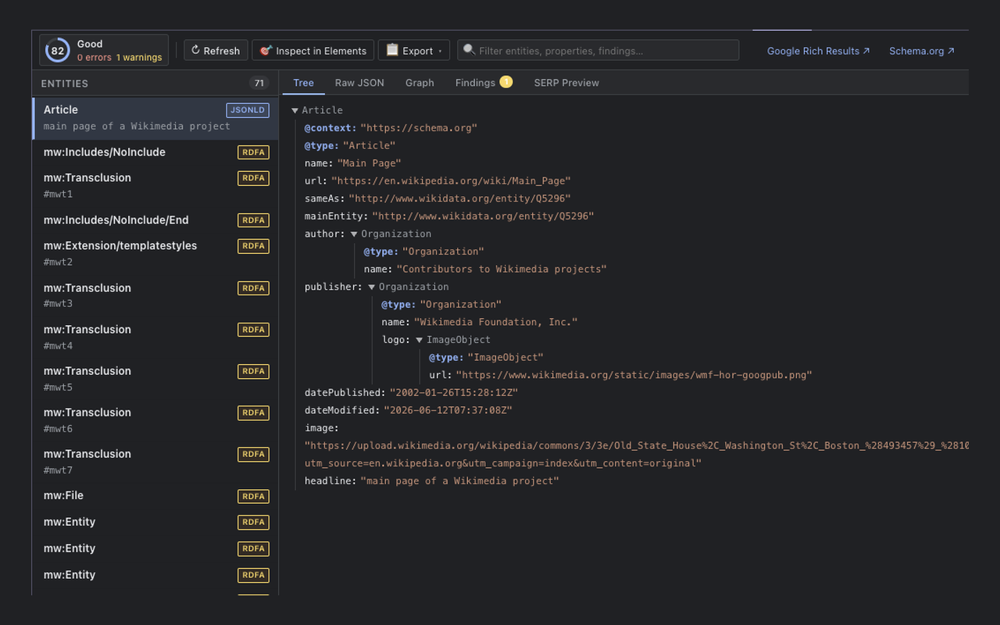

# Schema DevTools

Inspect, validate, and score structured data (**JSON-LD**, **Microdata**, **RDFa**) directly in Chrome DevTools. All analysis runs **100% locally** in your browser — zero host permissions, zero telemetry.



---

## Features

- **Dedicated DevTools Panel** — Comprehensive page-level structured data inspection with live SPA and DOM mutation tracking.
- **Elements Sidebar Pane** — Inspect structured data on the currently selected DOM node (`$0`) in the Elements panel.
- **Quality Score & Findings** — 0–100 quality score with real-time error, warning, and info breakdowns against Schema.org and Google Search rich-result guidelines.
- **Interactive Workspaces:**
  - **Tree View** — Collapsible syntax tree with `@id` graph navigation and schema.org documentation links.
  - **Raw JSON Sandbox** — Interactive editor to test schema fixes in real time.
  - **Findings View** — Filterable validation issues with direct guidelines links.
  - **SERP Preview** — Non-authoritative Google Search rich result simulations.
  - **Knowledge Graph** — Visual entity relationship network with `@id` connections.
- **In-Page Highlighting** — Hovering or clicking entities highlights corresponding DOM elements on the page.
- **AI & SEO Export** — One-click **Copy for AI Prompt**, normalized JSON bundles, and Markdown reports.
- **Indexability Guards** — Alerts when `noindex` or `nosnippet` robots meta tags block rich results in search.

---

## Quick Start (Load Unpacked)

1. Clone this repository.
2. In Chrome, navigate to `chrome://extensions` and enable **Developer mode**.
3. Click **Load unpacked** and select the project directory.
4. Open DevTools (`F12` / `Cmd+Option+I`) and select the **Schema** tab.

---

## Development & Commands

```bash
# 1. Local Browser Sandbox (http://localhost:3333)
npm run dev

# 2. Terminal CLI Validator
npm run validate ./path/to/schema.json
npm run validate https://example.com

# 3. Test Suite & Validation Audit
npm test

# 4. Build Distribution Bundle
npm run build
```

---

## Architecture Overview

| Directory | Purpose |
| --- | --- |
| `src/` | Extraction, normalization, scoring, and validation rule catalog |
| `ui/` | VanJS reactive UI components, views, and DevTools theme styles |
| `devtools/` | Chrome DevTools host panel, Elements sidebar, and message bridges |
| `sandbox/` | Standalone browser testbed and test fixtures (`npm run dev`) |
| `scripts/` | Bundling, CLI validation, and test automation scripts |
| `assets/icons/` | Extension icons and SVG master |

---

## Privacy & Security

- **Zero Host Permissions** — No network or background tab permissions requested.
- **Local-Only Processing** — All parsing, validation, and scoring execute entirely client-side.
- **Zero Telemetry** — No tracking, analytics, or remote logging.

---

## License

MIT
