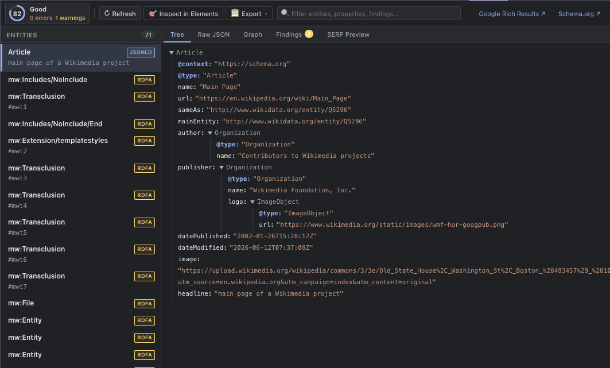
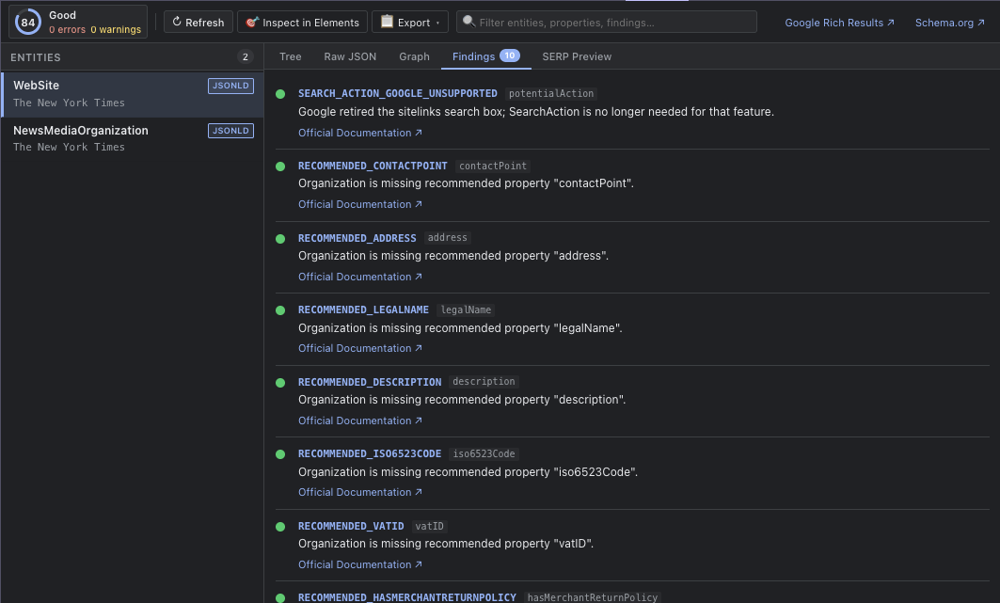

# Chrome Web Store listing — Schema DevTools

## Name

Schema DevTools

## Short description (summary, ≤132 characters)

Inspect, validate & score JSON-LD, Microdata & RDFa in Chrome DevTools. Local-only. No data collection.

## Detailed description

Schema DevTools adds a dedicated **Schema** panel to Chrome DevTools so you can debug structured data the same way you debug CSS or network requests.

**What it does**

- Extracts JSON-LD, Microdata, and RDFa from the page you're inspecting
- Validates markup against common schema.org and Google rich-result rules
- Shows a 0–100 quality score with error and warning counts
- Lists entities with interactive Tree, Raw JSON, Visual Knowledge Graph, and SERP Simulation views
- Adds a **Schema** sidebar pane in the Elements panel for the selected DOM node
- Copies JSON, script tags, agent bundles, and markdown summaries for AI-assisted workflows
- Opens Google Rich Results Test and Schema Markup Validator with the current page URL (only when you click)

**Privacy first**

- No host permissions
- No background data access
- No telemetry or analytics
- Analysis runs locally when DevTools is open

**Who it's for**

Developers, SEO engineers, and technical marketers who need fast, trustworthy structured-data feedback without leaving DevTools.

## Category

Developer Tools

## Language

English

## Privacy practices (for store form)

- **Single purpose:** Inspect and validate on-page schema markup in DevTools
- **Permissions:** None (uses `devtools_page` only)
- **Data collection:** None — all processing is local
- **Privacy policy URL:** https://brandonkramer.github.io/schema-devtools/privacy.html (Fallback: https://raw.githubusercontent.com/brandonkramer/schema-devtools/main/privacy.html)

## Screenshots & Store Assets

1. **Page Tree View & Quality Score**
   

2. **Validation Findings & Rules Breakdown**
   

### Chrome Web Store Upload Specifications
- **Dimensions:** Exactly `1280 × 800 px` or `640 × 400 px` (16:10 aspect ratio).
- **Format:** `.png` or `.jpg` (RGB/sRGB without transparent backgrounds).
- **Limit:** 1 to 5 screenshots in the Developer Dashboard gallery.

## Keywords (optional)

schema.org, JSON-LD, structured data, SEO, rich results, microdata, RDFa, DevTools
